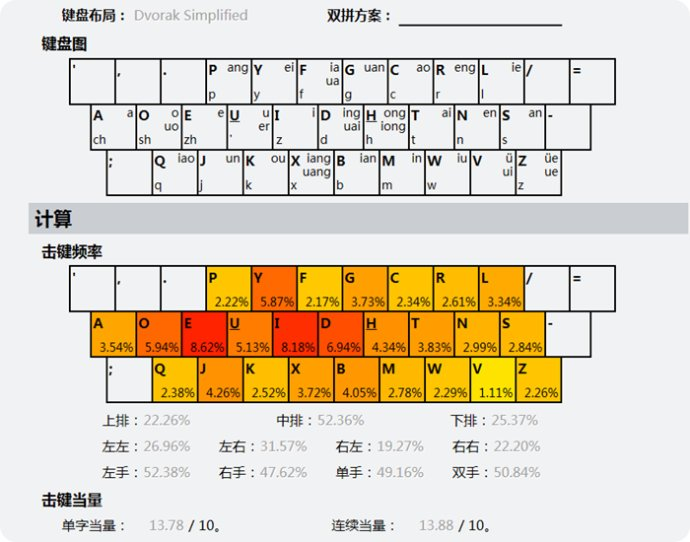

# Awesome Tools

A curated list of awesome tools I used.

本项目采用 [CC BY-NC 4.0](https://creativecommons.org/licenses/by-nc/4.0/) 协议

## 硬件与设备

### 笔记本

- MacBoox Pro (14-inch, 2021) M1 Pro/32GB/1TB. 公司电脑
- ***已回收*** MacBook Pro (13-inch, 2018) i5-8259U/16GB/512GB. 自用电脑，2018 款低配升级内存和硬盘，后购入 Apple Care，目前因为电池鼓包换过一次电池
- ***已不使用*** 华硕 N551JK i5-4200H/4+4GB/1TB. 曾经的电脑，已经不再使用

### 台式机

- 2020-10:
  - 主板: 华硕 B550M-PLUS(WI-FI) 重炮手
  - CPU: AMD R7 5800X
  - 内存: 芝奇幻光戟 DDR4 3200 16G ✖️️ 2
  - 电源: 振华 750W
  - 硬盘:
    - 西部数据 SN850 500G
    - 西部数据 SN550 1T
    - 西部数据 紫盘 4T
  - 显卡: 影驰 RTX3080 GAMER
  - 散热: 九州风神阿萨辛3
  - 机箱: 先马鲁班3
  - 机箱风扇: 雅俊 GF12 ✖️️ 3, 利民 TL-R12A

> 记录：阿萨辛3风扇在这个配置下有点尴尬，在散热方面是足够了，但是稍微有点高，已经略微顶住机箱侧板了；且风扇太大，内存被全部挡住了，有了马甲灯也看不到，而且因为内存马甲的问题，内存上面的散热部分安装不下 14 寸的风扇，只能把 12 寸的机箱风扇安到上面。

### 显示器

- LG 27UD58. 27 寸 4K 显示器，副显示器，2019年购入，当时购入的原因是最便宜的 4K 显示器。有两个 HDMI 一个 DP 接口
- LG 27UL550-W. 27 寸 4K 显示器，放在公司，也是廉价显示器，因为不关注色彩，只用来写代码，所以还是挺值的。也是两个 HDMI 一个 DP 接口，支架支持升降和竖屏，不过电源是外置的
- KTC M27P20. 27 寸 4K Mini Led 显示器，家里的主力显示器。支持 144hz 和 HDR1000，显示效果比较好，不过文字边缘更容易显示彩色，怀疑是像素点排列的原因。外置电源，个头很大，<del>有时还有啸叫</del>已更换电源，目前基本没有声音了。
- 淘宝 14寸 2K IPS 显示器. 当副屏使用，可视角度不是特别高。
- ***已不使用*** BenQ EW2445ZH. 23.8 寸 1080P 显示器，曾经的主力显示器，目前当副屏用。有两个 HDMI 和一个 VGA 接口

### 扩展坞和线材

因为 mbp 没有 USB-A 接口，所以需要单独购买扩展坞

- Moshi 摩仕一转四. 一个 HDMI，两个 USB，一个读卡器，其中 HDMI 只支持到 4K/30HZ，所以只用这个连接副屏。整体发热情况较好，不是特别烫
- 绿联一拖四扩展坞. 带电源的扩展坞
- 山泽 Type-C 转 DP 线. 用于连接那台 4K 显示器，可以到 60HZ。<del>存在的问题是少数时候显示器上不显示内容，需要重新插拔线或者开关显示器才能正常，不知道是哪一方的问题</del>（目前没有遇到过这个问题了）
- ***已退货*** 戴尔 DA300. 退货原因：DP接口在我的 4K 显示器上不显示东西
- ***找不到了*** 谷歌音频转换器. 用于给魅族 16s 转有线耳机，效果一般，（据说）电话时对方有杂音
- ***已不使用*** 网易智造网线转换器. 购于闲鱼

### 键盘

- Ergodone. 自焊二狗蛋，混轴分区压力，键帽混搭，主键区是无刻原厂高度 pbt 键帽。详情可以看 https://www.iwyvi.com/keyboard/ergodone-keyboard/
- xd84pro. 自焊键盘，混轴分区压力，键帽马里奥红白机 pbt，带 rgb 底灯，装了暖白按键灯
- ***已卖出*** gh60. 自焊客制化键盘. https://www.iwyvi.com/keyboard/gh60-keyboard/
- ***已卖出*** 贼鸥87. 超级便宜的有钢板凯华红轴机械键盘，用了快两年，期间出现了一些键无法触发的问题，手动换过好几次轴

### 鼠标

- 雷蛇那伽梵蛇进化版. 因为原来的微动双击了，换了左右键的微动，TTC 防尘金
- 雷蛇巴塞利斯蛇V2. 左侧横向滚轮微动无效了，还没有修
- ***已坏*** 雷蛇那伽梵蛇 2014. 二手鼠标，侧键不怎么舒服，右键一直不太舒服，自己换过两次微动
- ***已不使用*** 雷蛇炼狱蝰蛇. 家里使用
- ***已不使用*** ThinkPad 无线鼠标. 实习发的，已经送人

### 耳机

- ***已送人*** Bose QC35 II
- 小米圈铁 Pro. 主力入耳式有线
- ***已不使用*** 酷我 K3. <del>主力出门使用的蓝牙耳机，</del>选择的原因是非入耳式 + 便宜
- ***已退货*** QCY T1S. 入耳式戴起来有点难受，信号有时会断
- ***已不使用*** Beats Wireless Solo. 买电脑送的，夹头，超级紧。目前吃灰
- realme Buds Air. 白色，外观高仿 AirPods，做工一般，游戏模式延迟尚可
- ***已扔*** 水月雨银色飞船. 家里用的有线耳机。双耳音量不均衡，振膜保护被弄坏了，所以扔掉了
- ***已回收*** Redmi Air Dots3. 降噪效果可以，延迟稍高
- JBL Q TWS. 支持 2.4GHz 的接收器，基本没有延迟，用于玩游戏。主力出门耳机

### 音箱

- 漫步者 N300. 整体体验还可以，切换模式只支持手动触摸按钮，所以只当电脑音箱，不连蓝牙使用
- 小爱音箱 Play 增强版. 平时用于蓝牙连接听歌

### 游戏主机

- Switch. 2017年购入，红蓝配色，现在 JoyCon 已经漂移到可以自己玩游戏了
- PS4 Pro
- ***已卖出*** Steam Deck OLED 512G

### 手柄

- Switch Pro. Switch 主力，左摇杆有点推不到底了，现在喷了 WD-40，目测成功续命了一波. (2021-11) 更换了左侧摇杆的电位器，但是在系统里各个方向都推不倒底，所以还用砂纸打磨了摇杆外的塑料圈 https://www.iwyvi.com/joystick/switch-pro-review/
- DS4. PS4 主力，<del>加了一个（可能是山寨的 Kontrolfreek）摇杆增高帽</del>
- ***已卖出*** hori ngc 手柄. 为了玩大乱斗买的，结果玩大乱斗还是被虐. https://www.iwyvi.com/joystick/hori-ngc-controller-review/
- 八位堂 SF30Pro. 娱乐手柄. https://www.iwyvi.com/joystick/8bitdo-gamepad-review/
- Steam 手柄.  <del>Windows 主力</del>，自从升级支持蓝牙以后就完美了. https://www.iwyvi.com/joystick/steam-controller-review/
- 八位堂 Lite 中国红限定.  摇杆改成了十字键，号称永不摇杆漂移的手柄
- 八位堂 Zero. 超级小的手柄，用于解压？
- 八位堂 Zero 2. 一代的升级版，可以支持 Switch，手感和一代差不多
- Xbox 手柄 2020 款冰雪白. Windows 主力，十字键感觉是贴片微动，整体手感尚可
- 八位堂猎户座真无线手柄（NS版）. Switch 新主力，整体手感不错，外观也挺好看；带有两个背键，可以自定义配置；不支持 HD 振动，Switch 上用可以把振动调到最低档位

### 手机

- iPhone 16 Pro 沙漠金 256GB
- ***已回收*** iPhone 14 Pro 白色 256GB
- ***已回收*** 小米 10 ultra 黑色 12GB/256GB. 已成为测试机
- ***已回收*** 魅族 16s 6GB/128GB. 买了就降价 sad
- ***已送人*** 一加 3T 6GB/64GB. 用了两年以后电池极差 + 发热严重，期间手动换了一次淘宝上的黑皮电池
- ***已不使用*** 联想乐檬 K3 Note 2GB/16GB
- ***已不使用*** 诺基亚 Lumia 525. 第一款手机，改机型升到 wp10

### 平板

- ***已回收*** iPad Air 2019 64GB
- ***已扔*** 昂达 v820W. 目前已经变砖，因为某次重置系统后电源驱动挂了充不进去电，然后现在没电开不了机了

### 路由器

- NanoPi R2S. 软路由挂 clash
- Redmi AX5400. 支持 UU 加速
- ***已送人*** Redmi AX5
- ***已不使用*** 荣耀路由X2. 主力路由器，没什么特点吧，稍微有点大
- ***已不使用*** Au home. 体积很小的一个路由器，支持 5GHz，已经找不到了
- ***已卖出*** 网易 UU 加速盒. 买来用于主机加速，这样就不需要电脑开加速器了

### Kindle

- ***已不使用*** Kindle 558. 有点后悔没有入 998，这款既不清晰又没灯，所以吃灰了

### 手环

- ***已不使用*** 黑加. 支持公交卡比较方便，开通了京津冀交通联合卡
- ***已不使用*** WeLoop Now2. 目前已经不用了，不过目测没什么损耗

### 手表

- ***已回收*** Oppo watch（46mm，耀黑）. 由于看起来颜值比较高，且支持快冲，所以购入
- ***已回收*** Oppo Watch 2（42mm，蓝牙版）. 二代升级比较大，续航更长，性能更高，所以就把一代官方回收了。由于没有 esim 的需求，所以选择了蓝牙版
- ***已回收*** Oppo Watch 3 Pro 铂黑. 三代支持屏幕常显，续航也增加了，支持心电图
- Apple Watch S9（GPS版 星光色）

### 投影仪

- ***已退货*** 当贝 C1. 体积较大，整体也比较重，不是很适合便携使用；720P投影，清晰度还行，亮度白天不拉窗帘用不了。退货的主要问题是风扇声音太大了
- 小米投影仪青春版2. 比起当贝，这个声音小了很多，正常使用几乎听不见风扇声；1080P，支持侧投，亮度也是需要拉窗帘

### 充电头和移动电源

- 联想口红电源 65w. 最老的那个版本，略微有点啸叫，在柜子里吃灰
- 小米 Type-C 65w. 可折叠插脚， 放在公司给手机充电
- 摩米士 18w. 支持 PD 和 PE 协议
- ***已退货*** 努比亚氘锋 65W 单C口. 我拿到的这个使用 pd 协议充电时总是 15 分钟左右就断连，需要重新插拔
- 小米移动电源3 高配版. 20000mAh，支持各种快充协议，出门可以给电脑充电，还可以当 HUB，虽然几乎没用过这个功能
- 紫米折叠氮化镓充电器 20W. 给 iPhone 充电使用
- 小米磁吸充电宝. 带充电底座，比较好看，但是给 iPhone 无线充电时间长了会很烫
- ***已不使用*** 小米 55W 无线充电底座. 给小米手机充电还行，给 iPhone 充电似乎只有 5W，连风扇都基本上不工作
- CUKTECH 67W 三口
- CUKTECH 120W 三口
- CUKTECH 10 号超级电能充 Ultra. 可以显示功率

### 杂项

- ***已回收*** Apple Pencil 一代. 略吃灰
- ***已不使用*** 高漫 1060PRO 数位板. 效果极差，当时买来只是为了体验一下数位板什么感觉，然后就一直吃灰了
- Acasis 采集卡. 效果较差，偏色
- 米家显示器挂灯
- ***已卖出*** Oculus quest 2. 体验还可以，配了贴片眼镜，另外买了三方头带和面罩
- ***已卖出*** 米家激光测距仪
- 拓竹 A1 mini. 额外购买了光面打印板、低温打印板、0.2mm 不锈钢喷嘴
- 大疆 Osme Mobile 6 暗岩灰. 二手购入，额外配了一个手机磁吸连接器
- 大疆 Neo 畅飞套装
- 大疆飞行眼镜 N3
- 大疆 FPV 遥控器 3
- 星特朗 80EQpro
- 举目小红帽二代 Ultra 10x25. 单筒望远镜，清晰度和可视范围比想象中得大不少

### 汽车

- 小鹏 P5 510E 星湖灰

### 出行

- ***已卖出*** Ninebot One A1. 收的二手车，性能还可以，但是不适合上路，准备再出掉
- 大行 P8. 已改后刹车为永杰 959V
- BackWave 33 英寸陆地冲浪板

## 软件（PC）

### 编辑器和 IDE

- VS Code. 主力编辑器
- ***暂不使用*** Android Studio
- ***暂不使用*** IntelliJ IDEA
- ***暂不使用*** CotEditor. 据说很快，用来打开一些小文件
- Zed. 观察中
- Cursor. 主力编辑器

#### 扩展

##### VS Code

- <del>Better Comments</del>. 注释着色，因为着色方式不太喜欢，所以不用了
- <del>Bracket Pair Colorizer</del>. 括号着色。官方支持这个功能了，所以不再用插件了
- <del>Code Runner</del>
- <del>Code Time</del>. 本地记一下写代码的时间，已经弃用了
- colorize
- <del>Color Highlight</del>. 换成上面那个了
- Code Spell Checker
- ESLint
- Git History. 主力看 Git 记录，因为可以编辑器内一键查看
- GitLens. 偶尔看看行和文件记录
- <del>ident-rainbow</del>. 彩色缩进，不太好看，所以删除了
- Live Server
- Prettier
- Project Manager
- stylelint
- Todo Tree
- WakaTime. 主力记录代码时间. https://wakatime.com/@iwyvi
- Error Lens

### 终端

- iTerm2. <del>主力终端</del>
- ***暂不使用*** Hyper. 偶尔看看更新得怎么样了
- ***暂不使用*** eDex-UI. 用于偶尔装逼用
- Warp. 体验感觉还不错，已成为主力终端

- zsh + <del>oh-my-zsh</del> + starship

### 编程字体

- Lotion
- Isovka ss01. 主力编辑器字体，开启连字。这个字体的特点是很瘦，同样的屏幕大小可以显示更多内容
- Fira Code. 主力终端字体
- Cascadia Code. 最近尝试换新花样，将终端字体设为了这个
- 霞鹜文楷等宽
- Monaspace Krypton. 目前主要在用这个字体

### 主题配色

- MacOS 浅色主题
- Windows 浅色主题

#### 编辑器

- Chinolor. 自制 VS Code 主题. https://marketplace.visualstudio.com/items?itemName=iwyvi.chinolor
- Material Icon Theme. VS Code 图标主题
- Fluent Icons

#### 终端

- Chinolor. 终端里如果要使用需要手动按颜色配

### 命令行

- fnm. node 版本切换

#### homebrew

- neofetch
- m-cli. 这个几乎没怎么用过

### 浏览器

- Chrome. 曾经的主力
- ***已不使用*** Microsoft Edge Canary. Chromium 版 edge，意外的好用，<del>选择 canary 版是因为当时只有这个版本，然后一直也没有换成正式版，目前已成为主力浏览器，可以较为方便的多终端同步数据</del>
- Microsoft Edge. 主力浏览器，不用 Canary 版本是因为某次更新后，只要打开网页就卡好几秒
- Firefox
- Safari
- ***已不使用*** Vivaldi
- Arc. 外观很好看，侧栏 tab 也很好用。但是资源占用稍微有点多，<del>而且目前不支持地址栏选择搜索引擎</del>，Mac 端主力浏览器
- ***已不使用*** Stack Next SE. 看起来有潜力的浏览器，只是已经不更新了
- Zen. 基于 Firefox 的浏览器，界面仿照 Arc
- Fellou. AI 浏览器，偶尔用于查资料

#### 浏览器扩展

- Stylus. 由 Stylish 换过来
  - 百度多栏卡片搜索. 自改样式. https://userstyles.world/style/3156
  - <del>v2ex 扁平化风格</del>. https://userstyles.org/styles/128987/v2ex
  - <del>Tieba - Maverick 2018</del>. https://userstyles.org/styles/124770/tieba-maverick-2018
  - <del>weibo_v6</del>. 这个作者似乎不维护了，也没有在线地址。微博更新了视觉后就不用了
  - 谷歌多栏卡片搜索. 自改样式. https://userstyles.world/style/3155
- <del>Session Buddy</del> 用于存标签页，可是我本身不怎么喜欢开大量标签页，所以这个没怎么用
- FireShot. 网页截图
- Tampermonkey
- <del>京价保</del>
- <del>SwitchyOmega</del> 代理通过软路由控制
- <del>Adblock Plus</del>
- uBlock Origin
- <del>Octolinker</del>
- <del>Octotree</del> 这个不太好用
- JSON Formatter
- Wappalyzer. 查看网站技术栈
- Infinity 新标签页
- <del>v2ex plus</del>
- V2EX Polish

还有几个用于开发的插件

### 输入方式与输入法

键盘布局采用 dvorak 布局，中文输入方式为定制的一套 dvorak 的双拼布局，原作者好像是贴吧的一个大佬，现在已经找不到原始链接了

- ***已删除*** 搜狗输入法. <del>Mac 主力输入法，</del>使用原因是 Mac 上能支持自定义双拼方案的输入法选择很少（搜狗是通过覆盖默认方案实现的）
- ***已删除*** 手心输入法. <del>Windows 主力输入法</del>
- ***已删除*** 落格输入法. 感觉和我的输入习惯有点八字不合
- 鼠须管和小狼毫. 主力输入法，已经把自定义双拼布局转了过来。缺点：中英文混输和双拼 tab 辅助形码的功能不支持，缺少一些新词，不支持中英文混输。[查看配置](https://github.com/iwyvi/rime-config)

### 笔记

- ***已删除*** Typora. <del>偶尔写写 markdown 使用，</del>自从开始收费以后就不用了
- Notion. 目前主力笔记
- Obsidian

### 音乐

- 网易云音乐. 主力音乐播放器，ID：IwYvI
- 搜狗音乐. 偶尔使用
- QQ音乐. 偶尔使用

### 代理

- ***已不使用*** V2rayU. 由于机场协议是 v2ray 所以一直在用这个，目前已转为 ClashX
- ClashX
- ***已不使用*** Clash for Windows

### 杂项

只列出了已购入正版或有免费版的软件

- Enpass. 主力密码管理，<del>因为桌面端主要功能免费，所以目前只买了 Android 版，iOS 上手输或者 QQ 发密码（奇怪的操作）</del>. 这个已经改成买断 + 订阅了，不过因为之前买了安卓版，可以绑定账号以后全平台享受服务.
- ***已不使用*** Bartender 3. 隐藏 Mac 状态栏多余图标，合买
- ***已不使用*** Bartender 4. 合买
- ***已不使用*** Mos. 修改鼠标滚动缓动，改用 Mac Mouse Fix 了
- ***已不使用*** Cinch. 窗口管理，未授权版
- Spark. 主力邮件客户端
- SlowQuitApps. 防止 Cmd + Q 直接退出应用
- Snipaste. 主要用于贴图
- Itsycal. 状态栏日历
- Eagle. 收集素材和作品
- Wallpaper Engine. Steam 版
- LinearMouse. 移除鼠标加速度
- Raycast. 主力启动器
- Mac Mouse Fix. 滚动缓动
- AltTab. 应用切换器
- ***已不使用*** ActivityWatch. 记录操作时间

## 软件（移动端）

### 邮件

- ***已不使用*** Microsoft Outlook. <del>主力邮件客户端</del>，支持 Exchange 协议；在 MIUI 上收不到推送，不知道原因
- ***已不使用*** 极邮. 曾经的主力邮件客户端，好像不更新了，不支持 Android 新版
- ***已不使用*** 小米自带邮件客户端
- iOS 自带邮件客户端
- 网易邮箱大师. 公司邮件使用

### 音乐播放器

#### 在线

- 网易云音乐
- ***已不使用*** 搜狗音乐
- QQ音乐. 主要用来占手机空间
- ***已不使用*** 5sing. 偶尔去找找新的古风歌

#### 本地

- ***已不使用*** 魅族自带播放器. 意外的好用
- ***已不使用*** Retro Music. 曾经的主力，颜值较高

### 浏览器

- ***已不使用*** 夸克浏览器. 主力浏览器，颜值高，但是 webview 版本太老了
- ***已不使用*** Via. 曾经主力浏览器
- Chrome
- Edge. 因为可以和电脑同步，所以偶尔也用用它，移动端不是很好用
- Safari
- Arc Search

### 笔记

- GoodNotes
- Notability. 辅助笔记，用于记录课堂内容
- Notion. 配合其他端
- ***已不使用*** Nebo

### 绘图

- 概念画板. 主力绘图，主要用来当作草稿本用
- ***已不使用*** SketchBook
- ***已不使用*** Vectornator
- ***已不使用*** Painter

### 词典

- ***已不使用*** 欧路词典

### 天气

- ***已不使用*** 我的天气
- ***已不使用*** 几何天气
- 彩云天气 Pro

### 输入法

- 微信输入法. 主力输入法
- 百度输入法

### 开发相关

- PPHub. GitHub 第三方客户端，很纯净
- ***已不使用*** iSH. 终端
- Loon

## 服务 / 会员 / 订阅

### 免费

- OneDrive. <del>主力网盘，</del>同步照片，免费容量要满了，已不自动同步
- 坚果云. 存一些配置文件
- 百度网盘
- iCloud

### 付费（目前免费使用）

- ***已不使用*** Intellij 教育版（换用社区版）

### 付费

- ***已过期*** QQ 会员
- ***已过期*** Switch Online
- ***已过期*** PS4 Plus 港服
- 网易 UU 加速器会员
- 爱奇艺白金会员. 父母看电视使用
- 京东 plus 会员
- bilibili 大会员
- ***已过期*** v2ss
- 忍者云
- ***已过期*** Apple Care Protection
- 饿了么超级会员
- 网易云音乐黑胶会员. 白嫖到 2027 年
- ***已过期*** 百度网盘会员
- 淘宝 88VIP
- ***已过期*** 迅雷年费超级会员. 主要用于迅雷快鸟，将 300M 网升级为 500M，但是最近快鸟没有效果了
- ***已过期*** 联通 PLUS 白银会员. 升级 5G 速率，每月可以兑换会员
- ***已过期*** 小米有品 UP 会员.
- 网易严选 Pro 会员. 之前一次活动白嫖的，基本上没买过东西
- iCloud 200G 订阅
- ***已过期*** QQ 音乐会员，联通 PLUS 兑换
- 一生足迹订阅
- 熊猫吃短信订阅
